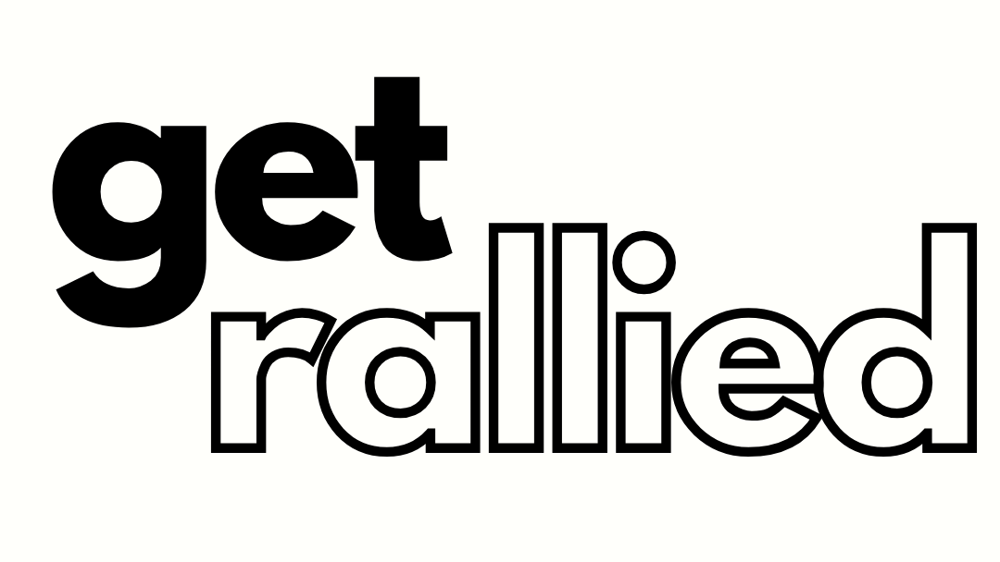

<p align="center">
  
</p>

<h3 align="center">Organize anything. Together.</h3>

<p align="center">
  Describe your vision. AI breaks it into tasks. People commit and show up knowing their role.
</p>

<p align="center">
  <a href="#quick-start">Quick Start</a> •
  <a href="#features">Features</a> •
  <a href="#how-it-works">How It Works</a> •
  <a href="#docker">Docker</a> •
  <a href="#environment-variables">Config</a> •
  <a href="#contributing">Contributing</a>
</p>

<p align="center">
  <a href="https://github.com/ercsn/getrallied-/blob/main/LICENSE"></a>
  = 18">
  
  
  
</p>

---

<p align="center">
  <a href="https://getrallied.com/getrallied-intro-v9.mp4">
    
    <br>
    <sub>▶ Watch the intro video</sub>
  </a>
</p>

---

## The Problem

You have a block party, a protest, a neighborhood cleanup — whatever. You shouldn't need a project manager to pull it off.

Most people can describe a vision. Few can decompose it into actionable tasks. **GetRallied does the breakdown for you.**

## How It Works

### 1. Describe your vision
> *"I want to organize a neighborhood cleanup on March 28. We need people to bring tools, handle refreshments, coordinate with the city, and manage sign-in."*

### 2. AI breaks it down
GetRallied generates specific, categorized tasks:
- 🧹 Bring rakes and trash bags *(5 needed)*
- 🍕 Handle food and drinks *(2 needed)*
- 📋 Manage check-in table *(1 needed, requires approval)*
- 🚛 Coordinate city dumpster drop-off *(1 needed, requires approval)*

### 3. People claim and commit
Share one link. Volunteers see the full task list, claim what they can do, and get email confirmation. The organizer sees everything on their dashboard.

**No group texts. No spreadsheets. No "I thought someone else was handling that."**

## Features

| | |
|---|---|
| 🧠 **AI task breakdown** | Describe your event, Claude generates 6-16 specific tasks |
| 📋 **Claimable tasks** | People browse and commit to what they can do |
| ✅ **Approval workflow** | Auto-approve general tasks, require sign-off for leadership roles |
| 🔒 **Public or private** | Toggle event visibility with one click |
| 🔗 **One link + QR code** | Share anywhere, works on any device |
| 📧 **Email notifications** | Organizer + volunteer confirmations via Brevo |
| 🔑 **Magic link login** | No passwords — organizers get a link via email |
| 🖼️ **Custom branding** | Upload event logo and banner image |
| 📤 **CSV export** | Download your full volunteer list |
| ↕️ **Drag-to-reorder** | Prioritize tasks with drag and drop |
| 🎯 **Admin panel** | Overview of all events, tasks, and people |

## Quick Start

```bash
git clone https://github.com/ercsn/getrallied-.git
cd getrallied-
npm install
cp .env.example .env
```

Edit `.env` with your API keys (at minimum, `ANTHROPIC_KEY`), then:

```bash
npm start
```

Open `http://localhost:19100` — you're live.

## Docker

```bash
cp .env.example .env
# Edit .env with your keys
docker compose up -d
```

## Environment Variables

| Variable | Required | Description |
|----------|:--------:|-------------|
| `PORT` | | Server port (default: `19100`) |
| `BASE_URL` | ✱ | Public URL for email links |
| `ANTHROPIC_KEY` | ✓ | Claude API key for AI task breakdown |
| `BREVO_KEY` | | Brevo API key for email notifications |
| `BREVO_LIST_ID` | | Brevo contact list for waitlist signups |
| `NOTIFY_EMAIL` | | Fallback notification email |
| `ADMIN_USER` | | Admin username (default: `admin`) |
| `ADMIN_PASS` | ✱✱ | Admin dashboard password |
| `DB_PATH` | | SQLite path (default: `./data/getrallied.db`) |

<sub>✱ Required for email links to work in production &nbsp;·&nbsp; ✱✱ Required to access `/admin`</sub>

## Tech Stack

- **Runtime:** Node.js
- **Framework:** Express
- **Database:** SQLite via better-sqlite3 — zero config, single file
- **Templates:** EJS
- **AI:** Claude (Anthropic API)
- **Email:** Brevo (optional)
- **Design:** Vanilla CSS, Inter font, black & white

No build step. No React. No webpack. Just a server that runs.

## Project Structure

```
getrallied/
├── server.js           # The entire app (~640 lines)
├── views/
│   ├── home.ejs        # Landing page
│   ├── event.ejs       # Public event page
│   ├── organizer.ejs   # Organizer dashboard
│   ├── admin.ejs       # Admin panel
│   ├── login.ejs       # Magic link login
│   └── event-picker.ejs
├── public/
│   ├── logo.png
│   └── uploads/
├── data/
│   └── getrallied.db   # Auto-created on first run
├── Dockerfile
├── docker-compose.yml
└── .env.example
```

## Neutral by Design

GetRallied is a coordination tool — not a platform with opinions. Block party, protest, bake sale, beach cleanup, book club, rally. **Any event. Any cause.** The tool helps people organize. That's it.

## Contributing

PRs welcome. This is intentionally a single-file server. If your change needs a build step, it probably doesn't belong here.

1. Fork it
2. Create your branch (`git checkout -b feature/my-thing`)
3. Commit (`git commit -am 'Add my thing'`)
4. Push (`git push origin feature/my-thing`)
5. Open a PR

## License

[MIT](LICENSE) — do whatever you want with it.

---

<p align="center">
  <strong>GetRallied</strong> — built for people who organize things.
</p>
